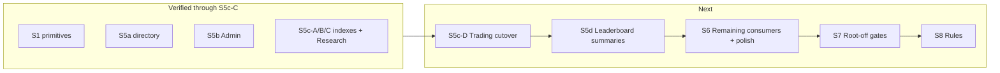

# Database Scoping Roadmap (S5–S8)

**Status:** Authoritative roadmap for remaining scoped Firebase loading work.  
**Verified baseline:** S5c-C (Research reservation cutover). S5c-D is not started.  
**Constraints:** Canonical `trades/*` remain execution authority. Missing/unverified reservation indexes must never mean zero reservations. The root `/` listener remains the intentional safety net until an evidence-gated S7 cutover. Prefer the smallest safe continuation from the verified architecture.

This document supersedes the historical S1–S8 investigation plan for **remaining** work. Completed phases below are recorded for reconciliation; implementation PRs must still list every file created/modified/deleted and every new named import/export.

Related code: [`js/database.js`](../js/database.js), [`js/db-hydration.js`](../js/db-hydration.js), [`js/trade-index.js`](../js/trade-index.js), [`js/trade-availability.js`](../js/trade-availability.js), [`js/player-directory.js`](../js/player-directory.js), [`ARCHITECTURE.md`](../ARCHITECTURE.md).

---

## 1. Executive status

Infrastructure and derived schemas through **S5c-C** are live beside the legacy root `/` listener. Admin browsing and Research reservations no longer require full `players` / `trades/*` runtime scans. Trading and live Leaderboards still do.

| Area | Status |
|------|--------|
| S1–S4 primitives, sharedDefs, current-player, personal audit | COMPLETE + VERIFIED |
| S5a `playerDirectory` + writers + rebuild | COMPLETE + VERIFIED |
| S5b Admin directory + selected-player scopes | COMPLETE + VERIFIED |
| S5c-A trade indexes + rebuild/drift | COMPLETE + VERIFIED |
| S5c-B lifecycle dual-writes + `shadowCompare` | COMPLETE + VERIFIED |
| S5c-C Research → verified `playerTradeIndex/{me}` | COMPLETE + VERIFIED |
| S5c-D Trading consumer cutover | **NOT STARTED** (prior attempt discarded; do not recover it) |
| Leaderboard summaries / live LB cutover | NOT STARTED |
| Root listener removal / scoped-only mode | NOT STARTED (intentionally retained) |
| Firebase rules tightening | NOT STARTED (docs-only samples; custom RTDB auth) |

**What remains:** finish Trading cutover in narrow subphases → leaderboard derived summaries (after a fresh planning pass) → remaining tab/lifecycle polish → evidence-gated root disable → rules docs/cutover.

**Next implementation phase after this document is committed:** **S5c-D1** (Trading hydration ownership APIs + Trading-owned `playerDirectory` subscription only — no reader cutover, no `listingsByGroup` acquire).

---

## 2. Original-plan reconciliation

| Original item | Status | Evidence | Disposition |
|---------------|--------|----------|-------------|
| S1 path primitives + merge + registry | COMPLETE + VERIFIED | `database.js` `loadPathOnce` / `subscribePath` / readiness; root still on | Keep as foundation |
| S2 sharedDefs hydrate | COMPLETE + VERIFIED | `db-hydration.js` + `main.js`; `accessCodes` excluded | Keep |
| S3 `players/{me}` + session guard | COMPLETE + VERIFIED | Auth-owned scope; guard via in-process `onValue` + descendant notify | Keep |
| S4 personal-tab audit | COMPLETE but superseded/refined | `db-read-audit.js`; `KNOWN_SCOPED_BLOCKERS` empty; Projects blocker remediated in S5c-C | Keep audit tooling |
| Original “S5 = directory + trade indexes + LB summaries” | PARTIALLY COMPLETE | Directory + trade indexes done; LB summaries not started | Split: S5a–S5c-* done; **S5d = LB** (fresh plan first) |
| Original “S6 = Trading/LB/Admin consumers + tab lifecycle” | PARTIALLY COMPLETE | Admin S5b; Research S5c-C; Trading not; LB not | Trading → **S5c-D\***; LB → **S5d**; residual → **S6** |
| Player picker → directory | NOT STARTED (runtime) | `trade-ui.js` `_renderPlayerPicker` → `getAllPlayers()` | **S5c-D2** |
| Own directs / listings index readers | Writers COMPLETE; Trading readers NOT | Dual-write in `trade-index.js`; Trading still canonical queries | **S5c-D3/D4** |
| `listingsByGroup` readers | Writers COMPLETE; readers NOT | Written on lifecycle; hydration deferred | **S5c-D5** (after soft-expire fix) |
| Trading reservations via index | NOT STARTED | Trading uses canonical `buildAvailabilitySnapshot` defaults | **S5c-D6** |
| Counterparty once-loads | NOT STARTED | Cache `db.get(players/{other})` only | **S5c-D7** |
| LB `leaderboards/{stat}/{user}` | NOT STARTED | Live boards still scan `players` | **S5d** (design direction only until re-planned) |
| Tab enter/leave hydrate helpers | PARTIALLY COMPLETE | Admin enter/cleanup exists; Trading cleanup is timer-only | **S5c-D1** + **S6** |
| Scoped persist allowlist | NOT STARTED | Full `scicards_db` persist remains | **S6/S7** |
| Bundled cards hybrid (S2b) | NO LONGER NEEDED as blocker | Shared once-load works | Out of critical path |
| Dual-mode flag disables root | Flag prep only | Does not cut over today | **S7** |
| S8 rules + Auth limits | NOT STARTED | `FIREBASE_SETUP.md` samples omit directory/indexes | **S8** |
| Exact RTDB query vs `listingsByGroup` | RESOLVED | Chose denormalized `listingsByGroup` | Preserve; do not reopen |
| Directory `displayName` | NO LONGER NEEDED | Username is key; no displayName field | Closed |
| Group vs groupId for directory | COMPLETE + VERIFIED | Directory uses `groupId` / `subgroupId` | Closed for directory |

**Material differences from the original plan:** S5 was correctly split into S5a/b/c-A/B/C. Research cutover landed before Trading. Original monolithic S6 is obsolete — do not revive it as one phase. A prior combined S5c-D attempt was discarded; subdivision is mandatory.

---

## 3. Current remaining full-read inventory

Framing: almost all “full-tree reads” are **in-memory cache scans**. Network full-tree is still `ref('/').once` + `ref('/').on` in `database.js`.

### Must disappear from normal runtime (before root-off)

| Path | Caller | Reason | Frequency | Replacement | Phase |
|------|--------|--------|-----------|-------------|-------|
| `/` once+on | `database.js` `initDB` | Legacy hydrate/live sync | Session + continuous | Per-scope load/subscribe only | S7 (after gates) |
| `players` | `trade-ui.js` → `getAllPlayers` | Direct trade picker | Trading renders | Trading-owned `playerDirectory` | S5c-D2 |
| `trades/direct` | `trading.js` `getPendingTrades` | Pending UI + timer | Trading open / ~5s | `playerTradeIndex/{me}/direct` | S5c-D3 |
| `trades/direct` | `trading.js` `createTradeOffer` duplicate scan | Duplicate pending | Per offer | Same PTI direct leaves | S5c-D3 |
| `trades/listings` | `getMyActiveListings` / create max-count | My listings | Trading renders | `playerTradeIndex/{me}/listings` | S5c-D4 |
| `trades/listings` | `getVisibleListings` | Group browse | Trading renders | `listingsByGroup/{groupId}` | S5c-D5 |
| `trades/listings` | `expireStaleListings` | Global expire | Tab enter + ~5s | Narrow strategy (D5 retain canonical temporarily → D7 finalize) | S5c-D5/D7 |
| `trades/direct` + `listings` | `buildTradeReservationCounts` defaults | Trading validation/UI locks | Many Trading call sites | Verified PTI maps (Research pattern) | S5c-D6 |
| `players` | `leaderboard-queries.js` `_buildPlayerEntries` | Live boards | LB tab | Derived leaderboard summaries | S5d |

### Expected to remain

Per-id `trades/direct/{id}`, `trades/listings/{id}`, canonical listing **claim transaction**, inventory/execution plans, auth `players/{me}`.

### Intentional Admin/dev repair scans (not regressions)

`rebuildPlayerDirectory`, `rebuildTradeIndexes`, drift/`shadowCompare`, season snapshot/reset, LB snapshot create/reset, player-delete trade cleanup scans.

### Dead / unwired (cleanup later)

`admin.js` (zero imports), unused `research.js` top-N / bulk migrate helpers at startup, deprecated unused `getMyActiveListing` import in trade-ui.

### Known correctness debt

`acceptListing` soft-expire updates canonical status via `db.update` **without** `listingIndexRemovalsForListing` (`trade-listings.js`). Can leave stale index leaves. **Must be repaired and verified in S5c-D5 before switching visible-listing discovery to `listingsByGroup`.**

---

## 4. Revised authoritative S5–S8 roadmap

| Phase | Goal | Stoppable valid state |
|-------|------|------------------------|
| **S5c-D1…D7** | Trading cutover in narrow commits | After each Di, Trading works; root still safety net; reservations never silently zero |
| **S5d** | Leaderboard summary work — **begins with a fresh investigation/planning pass** | Live LB no longer scans `players` (after approved S5d plan + implementation) |
| **S6** | Remaining consumers/polish: accessCodes scoped register load, logout foreign-cache clear, dead-code cleanup, persist-allowlist prep, audits green under isolation | App still has root |
| **S7** | Evidence-gated disable of root listener | Scoped-only mode; emergency re-enable root |
| **S8** | Rules documentation + realistic tightening under custom auth limits | Defense-in-depth; Auth/Admin SDK called out as true enforcement |

Do **not** remove root merely because indexes exist. Do **not** disable Trading canonical fallback until D6/D7 gates pass.

---

## 5. Detailed S5c-D subdivision

Order is mandatory: **D1 → D2 → D3 → D4 → D5 → D6 → D7**.  
Self-reservations use `playerTradeIndex/{me}` only (same as Research). `listingsByGroup` is discovery, not reservation authority.

### S5c-D1 — Trading hydration ownership + `playerDirectory` subscribe (no reader cutover)

- **Goal:** Implement Trading hydration ownership APIs and wire enter/leave lifecycle. The **only new observable Trading Firebase subscription** in this phase is **`playerDirectory`**. Do **not** acquire `listingsByGroup/{groupId}` in D1 (deferred to D5 unless a later investigation proves D1 cannot work without it — current investigation does not).
- **Functions:** extend `renderTrading` / `cleanupTrading`; add Trading ensure/release helpers in `db-hydration.js`; wire from `ui.js` tab switch.
- **Files:** `db-hydration.js`, `trade-ui.js`, `ui.js` (thin), optionally `db-read-audit.js` workflow stub.
- **Reads before/after:** unchanged (canonical). Picker still uses `getAllPlayers` until D2.
- **Hydration ownership:**
  - Trading-owned `playerDirectory` once + subscribe (refCount 1 for Trading; **must not** share Admin’s directory subscription).
  - Auth `playerTradeIndex/{me}` remains auth-owned — Trading reuses cache, does not second-subscribe.
  - `listingsByGroup` APIs may be stubbed/named for later, but **must not subscribe** in D1.
- **Fallback:** N/A for readers.
- **Failure:** directory ensure failure → surface error/retry for Trading shell; do not wipe trades; root still feeds cache; do not fall back to weakening reservation policy.
- **Verification tests:** enter Trading → registry shows Trading `playerDirectory` (and auth scopes); leave → Trading directory released; Admin directory exclusivity preserved; PTI refCount stays 1; no `listingsByGroup` subscription; gameplay/trading behavior unchanged.
- **Completion gate:** commit when registry lifecycle is stable, only new Trading sub is `playerDirectory`, and there is no reader/behavior cutover.

### S5c-D2 — Direct player picker → `playerDirectory`

- **Goal:** Replace `getAllPlayers()` in `_renderPlayerPicker` only.
- **Functions:** `_renderPlayerPicker`; Trading directory read helper; same-group / restricted / hidden filters as today.
- **Files:** `trade-ui.js`, possibly `player-directory.js` helper; uses D1 hydration.
- **Reads:** before full `players` scan; after `playerDirectory` children (Trading scope).
- **Hydration:** Trading-owned `playerDirectory` from D1.
- **Fallback:** if directory unready → empty picker + rebuild guidance / retry — **not** silent `getAllPlayers` fallback.
- **Failure:** cannot pick targets until ready; no reservation impact.
- **Verification tests:** same-group peers appear; hidden/restricted filtered; Admin + Trading both open without shared-sub errors; create offer still works (foreign `players/{target}` may still be root-fed until D7).
- **Completion gate:** picker never calls `getAllPlayers`.

### S5c-D3 — Pending directs + duplicate check → PTI direct

- **Goal:** `getPendingTrades` + duplicate-offer scan read `playerTradeIndex/{me}/direct` when verified.
- **Functions:** `getPendingTrades`, `createTradeOffer` duplicate loop; UI refresh/timer unchanged.
- **Files:** `trading.js`, light `trade-ui.js` if needed; metrics/audit.
- **Reads:** before full `trades/direct`; after PTI direct leaves (actions still per-id canonical).
- **Hydration:** reuse auth PTI (already session-long).
- **Fallback:** under root coexistence, prefer explicit `canonical-fallback` when index unready (mirror Research); never treat missing/unverified index as “no pending ⇒ safe.” Under isolation without fallback → fail-closed.
- **Failure:** fail-closed under isolation; do not invent empty trusted pending state that hides real reservations.
- **Verification tests:** incoming/outgoing parity vs canonical; duplicate offer still blocked; cancel/respond/confirm unaffected; `shadowCompare` clean for user.
- **Completion gate:** Trading pending path audit shows no full `trades/direct` when index verified.

### S5c-D4 — My Listings + create max-count → PTI listings

- **Goal:** Owner listing queries use `playerTradeIndex/{me}/listings`.
- **Functions:** `getMyActiveListings`, `_validateCreateListing` active count; cancel/accept still canonical per-id.
- **Files:** `trade-listings.js`, `trade-ui.js` as needed.
- **Reads:** before full `trades/listings` for owner views; after PTI listings.
- **Hydration:** auth PTI.
- **Fallback:** same readiness policy as D3.
- **Verification tests:** multi-listing display; max-active enforcement; create/cancel refresh; Research last-copy still locks.
- **Completion gate:** My Listings path does not full-scan listings when index verified.

### S5c-D5 — Soft-expire index repair, then Available listings → `listingsByGroup`

- **Goal:** (1) **First** repair and verify the `acceptListing` soft-expire canonical/index lifecycle gap; (2) **then** switch visible-listing discovery to `listingsByGroup/{groupId}` and acquire the Trading `listingsByGroup` subscription.
- **Order inside D5 (mandatory):**
  1. Fix soft-expire path to acknowledged multi-path update including `listingIndexRemovalsForListing` (parity with `expireStaleListings`).
  2. Manually verify soft-expire clears owner + group index leaves (and does not leave stale browsable group entries).
  3. Only after that gate: activate Trading-owned `listingsByGroup/{myGroup}` hydrate/subscribe; rewrite `getVisibleListings` to the group index.
- **Functions:** `acceptListing` expire branch; `getVisibleListings`; Trading `listingsByGroup` ensure/release in `db-hydration.js` / `cleanupTrading`.
- **Files:** `trade-listings.js`, `db-hydration.js`, `trade-ui.js`, `trade-index.js` if helper needed.
- **Reads:** discovery before full listings → after group index once cutover begins; **`expireStaleListings` may still scan canonical** this phase (explicit temporary while root exists).
- **Hydration:** first Trading acquire of `listingsByGroup/{myGroup}` (enter/leave with Trading tab).
- **Fallback:** unready group meta → empty discovery + retry (or documented canonical-fallback under root for discovery only). Discovery empty is acceptable; reservation correctness is D6.
- **Failure:** claim transaction remains exclusivity authority; do not treat unready group index as authoritative for claim.
- **Verification tests:** soft-expire dual-write fix proven; visible listings match group; claim removes from group index; processing not browsable; soft-expired listings disappear from index-backed discovery.
- **Completion gate:** soft-expire repair verified **and** Available listings no longer full-scan when group index ready; expireStaleListings debt documented for D7.

### S5c-D6 — Trading self-reservations → verified PTI

- **Goal:** Trading UI + self validation use index-backed maps (mirror Research), without weakening reservation safety.
- **Functions:** `buildTradingAvailabilitySnapshot` (or shared resolver with surface tag); switch trade-ui + self-side validators; counterparty snapshots may remain canonical until D7.
- **Files:** `trade-availability.js`, `trading.js` / `trade-listings.js` validation call sites, `trade-ui.js`, metrics.
- **Reads:** self reservations before dual full trees → PTI maps when verified.
- **Hydration:** auth PTI + `tradeIndexMeta` readiness (already).
- **Fallback:** `canonical-fallback` under root coexistence; `unavailable` / `loading` → `reservationsTrusted: false` and **block** offer/accept/create (fail-closed); never empty trusted counts.
- **Failure:** fail-closed; missing index ≠ zero reservations.
- **Verification tests:** last-copy offer/listing blocked; Research + Trading agree; isolation fail-closed; metrics fallback/failClosed counters.
- **Completion gate:** verified-index Trading self path does not default-scan `trades/*` for reservations.

### S5c-D7 — Counterparty once-loads, expiry finalization, audit, cutover verification

- **Goal:** Accept/respond/confirm work without relying on root-fed foreign players; finalize expiry so normal Trading runtime need not scan all listings; ship S5c-D audit workflow; prove listing claim robustness.
- **Functions:** `loadPathOnce` for `players/{other}` (and if needed once `playerTradeIndex/{other}` for counterparty reservation checks); expiry policy finalization (expire-on-read / accept-path / Admin sweep — not student full-tree forever); reactive refresh may stay timer-based on indexes; `workflowS5cD`.
- **Files:** `trading.js`, `trade-listing-execution.js`, `trade-listings.js`, `db-hydration.js`, `db-read-audit.js`, and docs updates as needed.
- **Reads before/after:** foreign player dependence on root → scoped once-load under action; expiry full scan removed or Admin-only.
- **Hydration:** action-scoped once-loads; no permanent subscribe to other players.
- **Fallback:** if counterparty once-load fails → abort action (do not invent inventories).
- **Mandatory completion gates (verification tests):**
  1. Listing-accept **happy path** (end-to-end success) — previously deferred; **required** for S5c-D pass.
  2. **Two-browser listing-claim race** — exactly one winner; loser fails cleanly; indexes/canonical agree — previously deferred; **required**.
  3. **Browser-close-after-claim** processing / fail-closed behavior — if practical in the test environment: claim reaches `processing`, accepter disconnects/closes before fulfill completes, and the system leaves a recoverable/fail-closed state (no silent double-fulfill; release/restore or explicit failed/processing handling as designed). If impractical to automate, document a manual script and execute it once before calling D7 complete.
  4. Two-browser direct respond/confirm still correct; logout clears Trading scopes; Trading normal runtime no longer requires full `players` / `trades/direct` / `trades/listings` cache scans (root may still run as safety net).
- **Completion gate:** all mandatory tests above pass; S5c-D audit workflow documented and green under the agreed isolation/fallback policy.

---

## 6. S5d and later architecture

### S5d — Leaderboard summaries (design direction only)

**S5d begins with a fresh investigation/planning pass before any implementation.** The notes below are **design direction** from the original roadmap and current inventory — **not** an implementation specification. Do not treat field shapes, writer lists, or hydration details here as locked until that planning pass revises and approves them against the then-current repository.

**Today:** Live boards scan all `players` (`leaderboard-queries.js` `_buildPlayerEntries`). Archived seasons / snapshots are already entry-shaped.

**Directional ideas to re-evaluate in the S5d planning pass:**

- Derived summary nodes (historically sketched as `leaderboards/{statType}/{usernameKey}` with score + group fields + `updatedAt`)
- Writers piggybacked on existing acknowledged mutation plans vs rebuild jobs
- Group filters via projected `groupId` / `subgroupId` (directory remains identity/group projection — scores should not bloat `playerDirectory`)
- Tab-scoped hydration for live boards; seasons/snapshots largely unchanged
- Admin season rotate / snapshot may remain explicit bulk operations

**Sequence:** S5d planning → approved S5d plan doc/section update → implementation. S5d must not start until S5c-D is complete unless a later decision explicitly parallelizes planning-only work.

### S6 — Remaining consumers and polish

accessCodes register-only scoped load; logout foreign-player cache clear; dead-code cleanup; persist-allowlist prep; personal + Trading + LB isolation audits PASS while root still on.

### S7 — Root-off

Evidence-gated disable of root listener via existing flag prep (`qc_scoped_loading` / `config/firebase/scopedLoadingEnabled`). Dual-mode: exactly one fan-in authority.

### S8 — Rules

Sample rules + docs for directory/indexes/leaderboards; honest documentation of custom-auth limits; Firebase Auth / Admin SDK as true enforcement follow-on.

---

## 7. Root-removal prerequisites

Root may be disabled only when **all** are true:

1. Shared defs (`config|cards|packs|groups`) hydrate without root; seeds only if path ready  
2. Auth: `players/{me}` subscribe; session invalidation works with scoped descendant notify alone  
3. `playerTradeIndex/{me}` session scope; Research + Trading reservations verified-index or explicit fail-closed  
4. Trading: directory picker; PTI pending/my listings; `listingsByGroup` discovery; counterparty once-loads; no runtime full `trades/*` / `players` scans  
5. Leaderboard live boards use summaries (S5d done per its approved plan)  
6. Admin: directory + selected-player only for browsing  
7. Register: `accessCodes` available without needing full root (S6)  
8. Logout: release all scopes; `clearCachedPath` foreign players / prior user  
9. Metrics: `rootListenerCount === 0` in scoped mode; path snapshots only; isolation audits PASS  
10. Local-only mode still works  
11. Dual-mode invariant: never run root wholesale replace and scoped merge as competing authorities without freeze  
12. Emergency rollback: flag off restores root  

Until then, root remains the intentional safety net.

---

## 8. Rules prerequisites

Before tightening rules beyond open classroom demos:

1. Document that **custom RTDB passwords ≠ Firebase Auth** — client scoping is not cryptographic enforcement  
2. Extend sample rules for `playerDirectory`, `playerTradeIndex`, `listingsByGroup`, `tradeIndexMeta`, `leaderboardSeasons`, `leaderboardSnapshots`, and any leaderboard summary roots approved in S5d  
3. Directory/indexes must never include password/session/inventory secrets  
4. Without Firebase Auth, document residual malicious-client risk even if path samples look “tight”  
5. Claim exclusivity remains the canonical listing transaction; rules cannot replace that without Auth/Cloud Functions  
6. True production lockdown requires Firebase Auth (or Admin SDK / Functions) — S8 follow-on, not a silent S7 assumption  

---

## 9. Risk register

| Phase | Risk | Why |
|-------|------|-----|
| S5c-D1 | Low | Lifecycle + directory subscribe only; no reader cutover |
| S5c-D2 | Low | UI filter swap; directory already correct |
| S5c-D3 | Medium | Pending UX + duplicate correctness; fallback policy |
| S5c-D4 | Medium | Multi-listing + max-active edge cases |
| S5c-D5 | Medium–High | Soft-expire repair must precede discovery cutover; expiry still hybrid |
| S5c-D6 | High | Reservation safety; fail-closed vs fallback; Trading/Research parity |
| S5c-D7 | High | Counterparty loads; claim races; browser-close-after-claim; expiry finalization |
| S5d | Medium–High | Depends on fresh plan; write amplification / group fan-out likely |
| S6 | Low–Medium | Polish; accessCodes; cache clearing |
| S7 | High | Removes safety net |
| S8 | High (security reality) | Custom auth limits what rules can guarantee |

---

## 10. Recommended implementation order

1. **This document** committed as source of truth (done when present in repo)  
2. **S5c-D1** — Trading hydration ownership + Trading `playerDirectory` subscribe only  
3. S5c-D2 → D3 → D4 → D5 → D6 → D7 (one commit each; manual test gates; no mega-phase)  
4. **S5d investigation/planning pass** → approve S5d implementation plan → implement  
5. S6 polish  
6. S7 root-off  
7. S8 rules  

Do not restart a combined “S5c-D everything” task. Do not implement S5d from this document’s directional notes alone.

---

## 11. Document maintenance

- **Canonical path:** [`docs/DATABASE_SCOPING_ROADMAP.md`](DATABASE_SCOPING_ROADMAP.md)  
- **Pointer:** [`ARCHITECTURE.md`](../ARCHITECTURE.md) scoped-loading section links here  
- Update this file when a subphase completes (status tables) or when S5d planning supersedes the directional notes in §6  
- Historical phase write-ups in `ARCHITECTURE.md` remain useful archaeology; **remaining work is governed by this roadmap**
