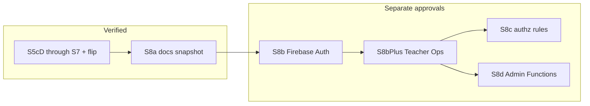

# Database Scoping Roadmap (S5–S8)

**Status:** Authoritative roadmap for remaining Firebase work after scoped loading.  
**Verified baseline:** **S5c-D** (incl. **S5c-D7** / **S5c-D7c**), **Hybrid C+ Gates A/B/C**, **S5d**, **S6** (S6a–S6e; **S6c** intentionally deferred), and **S7** (S7a–S7d) are **COMPLETE + VERIFIED**. **Scoped trade action hydration fix — COMPLETE + VERIFIED**. **Scoped claim null-safety fix — COMPLETE + VERIFIED**. **Scoped classroom default flip — COMPLETE + VERIFIED**. **Card-art transient retry hardening — COMPLETE + VERIFIED**. **S8a** (docs + live rules snapshot) — **COMPLETE**. **S8b** Firebase Auth foundation — **COMPLETE**. **S8b+ P0** Trusted Teacher Functions foundation — **IMPLEMENTED — AWAITING VERIFICATION** (dormant; not a launch dependency). **S8c-0** client prep (foreign trade-visible reads + `admins/{uid}` registry) — **COMPLETE + VERIFIED**. **S8c-1** (tradeGrants + locked rules) — **COMPLETE + VERIFIED**. **Auth production-default flip** — **IMPLEMENTED — AWAITING VERIFICATION** (`workflowAuthDefaultFlip`). **S8c-2** — NOT STARTED.  
**Constraints:** Canonical `trades/*` remain execution authority. Missing/unverified reservation indexes must never mean zero reservations. Prefer the smallest safe continuation from the verified architecture.

This document supersedes the historical S1–S8 investigation plan for **remaining** work. Completed phases below are recorded for reconciliation; implementation PRs must still list every file created/modified/deleted and every new named import/export.

Related code: [`js/database.js`](../js/database.js), [`js/db-hydration.js`](../js/db-hydration.js), [`js/trade-index.js`](../js/trade-index.js), [`js/trade-availability.js`](../js/trade-availability.js), [`js/player-directory.js`](../js/player-directory.js), [`ARCHITECTURE.md`](../ARCHITECTURE.md).

---

## 1. Executive status

Infrastructure through **S5c-D**, Hybrid C+, and **S5d** is live beside the legacy root `/` listener. Admin browsing, Research, Trading, and live Leaderboards no longer require full `players` / `trades/*` runtime scans for their cutover consumers.

| Area | Status |
|------|--------|
| S1–S4 primitives, sharedDefs, current-player, personal audit | COMPLETE + VERIFIED |
| S5a `playerDirectory` + writers + rebuild | COMPLETE + VERIFIED |
| S5b Admin directory + selected-player scopes | COMPLETE + VERIFIED |
| S5c-A trade indexes + rebuild/drift | COMPLETE + VERIFIED |
| S5c-B lifecycle dual-writes + `shadowCompare` | COMPLETE + VERIFIED |
| S5c-C Research → verified `playerTradeIndex/{me}` | COMPLETE + VERIFIED |
| S5c-D1 Trading `playerDirectory` hydration ownership | COMPLETE + VERIFIED |
| S5c-D2 Direct trade picker → `playerDirectory` | COMPLETE + VERIFIED |
| S5c-D3 Pending directs + duplicate → PTI direct | COMPLETE + VERIFIED |
| S5c-D4 My Listings + create max-count → PTI listings | COMPLETE + VERIFIED |
| S5c-D5a acceptListing soft-expire index parity | COMPLETE + VERIFIED |
| S5c-D5b Available Listings → `listingsByGroup` | COMPLETE + VERIFIED |
| S5c-D5 Trading discovery + soft-expire (umbrella) | COMPLETE + VERIFIED |
| S5c-D6 Trading self-reservations → PTI | COMPLETE + VERIFIED |
| S5c-D7a Counterparty once-loads + foreign PTI reservations | COMPLETE + VERIFIED |
| S5c-D7b Expiry finalization (no student full-tree scan) | COMPLETE + VERIFIED |
| S5c-D7c Isolation audit + multi-browser cutover proofs | **COMPLETE + VERIFIED** |
| S5c-D7 / S5c-D (Trading cutover umbrella) | **COMPLETE + VERIFIED** |
| Hybrid C+ Gate A (inventory ≥0 rules + ack sentinel safety) | **COMPLETE + VERIFIED** |
| Hybrid C+ Gate B (direct claim + relative inventory) | **COMPLETE + VERIFIED** |
| Hybrid C+ Gate C (listing claim + relative inventory fulfill) | **COMPLETE + VERIFIED** |
| Leaderboard summaries / live LB cutover (S5d) | **COMPLETE + VERIFIED** |
| S6a accessCodes register/bootstrap once-load | **COMPLETE + VERIFIED** |
| S6b logout / forced-exit personal cache clear | **COMPLETE + VERIFIED** |
| S6c dead-code cleanup | **OPTIONAL / DEFERRED** (intentionally skipped) |
| S6d persist-allowlist prep | **COMPLETE + VERIFIED** |
| S6e final isolation audits | **COMPLETE + VERIFIED** |
| S6 overall (consumers/polish) | **COMPLETE + VERIFIED** (S6c deferred, not a blocker) |
| S7a persist enforce + sanitize-on-load | **COMPLETE + VERIFIED** |
| S7b dual-mode root skip | **COMPLETE + VERIFIED** |
| S7c fail-closed + Admin access + LB archives | **COMPLETE + VERIFIED** |
| S7d final evidence matrix | **COMPLETE + VERIFIED** |
| S7 overall | **COMPLETE + VERIFIED** |
| Classroom default flip of scoped mode | **COMPLETE + VERIFIED** |
| Scoped trade/listing canonical-by-ID hydration | **COMPLETE + VERIFIED** |
| Scoped RTDB claim null-safety | **COMPLETE + VERIFIED** |
| Card-art transient retry hardening | **COMPLETE + VERIFIED** |
| Root listener / emergency root | Production default scoped; `qc_force_root_loading` → root once+on (keep through S8c) |
| S8a rules docs + live snapshot | **COMPLETE** (no authz deploy; no Firebase Auth) |
| S8b Firebase Auth under username UX | **COMPLETE** (foundation) |
| S8b+ P0 Trusted Teacher Functions foundation | **IMPLEMENTED — AWAITING VERIFICATION** (dormant / not launch-required) |
| S8c-0 client prep (trade-visible foreign reads + admins registry) | **COMPLETE + VERIFIED** |
| S8c-1 tradeGrants + RTDB authorization rules | **COMPLETE + VERIFIED** (locked rules live) |
| Auth production-default flip | **IMPLEMENTED — AWAITING VERIFICATION** (`workflowAuthDefaultFlip`) |
| S8c-2 foreign stats/LB/PTI tightening | NOT STARTED |
| S8d privileged Admin path / Functions | NOT STARTED (optional later; Spark path preferred) |

**What remains:** Verify Auth production default on a clean browser (`qcPersonalAudit.workflowAuthDefaultFlip()`). Optional S8c-2 / Option C / distribution bootstrap ([`docs/BEFORE_DISTRIBUTION.md`](BEFORE_DISTRIBUTION.md)). Scoping architecture is done. S6c remains deferred (not a blocker). **Unique Cards correctness repair — COMPLETE + VERIFIED** (orphans retained; orphan cleanup / pack hygiene deferred). Foreign-PTI readiness warnings = **diagnostic noise** (not index corruption).

**Next:** Verify Auth production default on a clean browser (`qcPersonalAudit.workflowAuthDefaultFlip()`). Do not begin S8c-2 / Option C / S8d until separately approved.

---

## 2. Original-plan reconciliation

| Original item | Status | Evidence | Disposition |
|---------------|--------|----------|-------------|
| S1 path primitives + merge + registry | COMPLETE + VERIFIED | `database.js` `loadPathOnce` / `subscribePath` / readiness; root still on | Keep as foundation |
| S2 sharedDefs hydrate | COMPLETE + VERIFIED | `db-hydration.js` + `main.js`; `accessCodes` excluded | Keep |
| S3 `players/{me}` + session guard | COMPLETE + VERIFIED | Auth-owned scope; guard via in-process `onValue` + descendant notify | Keep |
| S4 personal-tab audit | COMPLETE but superseded/refined | `db-read-audit.js`; `KNOWN_SCOPED_BLOCKERS` empty; Projects blocker remediated in S5c-C | Keep audit tooling |
| Original “S5 = directory + trade indexes + LB summaries” | COMPLETE | Directory + trade indexes + LB summaries verified | Split: S5a–S5c-* + **S5d** all **COMPLETE + VERIFIED** |
| Original “S6 = Trading/LB/Admin consumers + tab lifecycle” | PARTIALLY COMPLETE | Admin/Research/Trading/LB cutovers landed in S5*; residual polish remains | Residual → **S6** |
| Player picker → directory | COMPLETE + VERIFIED | Trading-owned `playerDirectory` | Keep |
| Own directs pending + duplicate | COMPLETE + VERIFIED | `playerTradeIndex/{me}/direct` | Keep |
| Own listings My Listings + max-active | COMPLETE + VERIFIED | `playerTradeIndex/{me}/listings` | Keep |
| `listingsByGroup` readers | COMPLETE + VERIFIED | Trading-owned hydrate + `getVisibleListings` cutover | Keep |
| Trading reservations via index | COMPLETE + VERIFIED | `buildTradingSelfAvailabilitySnapshot` → verified PTI | **S5c-D6** |
| Counterparty once-loads | COMPLETE + VERIFIED | `loadTradingCounterpartyContext` → `players/{other}` + PTI | **S5c-D7a** |
| LB `leaderboards/{statKey}/{user}` | COMPLETE + VERIFIED | Live boards read Firebase-safe summary keys (no student `players` scan) | **S5d** |
| Tab enter/leave hydrate helpers | PARTIALLY COMPLETE | Admin + Trading directory + listingsByGroup enter/cleanup done | **S6** residual |
| Scoped persist allowlist | **S6d** + **S7a** COMPLETE + VERIFIED | Filter ON under production scoped or `qc_persist_enforce` | Classroom default flip: persist follows boot latch |
| Bundled cards hybrid (S2b) | NO LONGER NEEDED as blocker | Shared once-load works | Out of critical path |
| Dual-mode flag disables root | Flag prep only | Does not cut over today | **S7** |
| S8 rules + Auth limits | **S8a COMPLETE**; S8b–S8d not started | Live snapshot in `database.rules.json`; Auth still required for authz | **S8 SPLIT** |
| Exact RTDB query vs `listingsByGroup` | RESOLVED | Chose denormalized `listingsByGroup` | Preserve; do not reopen |
| Directory `displayName` | NO LONGER NEEDED | Username is key; no displayName field | Closed |
| Group vs groupId for directory | COMPLETE + VERIFIED | Directory uses `groupId` / `subgroupId` | Closed for directory |

**Material differences from the original plan:** S5 was correctly split into S5a/b/c-A/B/C. Research cutover landed before Trading. Original monolithic S6 is obsolete — do not revive it as one phase. A prior combined S5c-D attempt was discarded; subdivision is mandatory.

---

## 3. Current remaining full-read inventory

Framing: almost all “full-tree reads” are **in-memory cache scans**. Network full-tree is still `ref('/').once` + `ref('/').on` in `database.js`.

### Must disappear from normal runtime (before root-off)

| Path | Caller | Reason | Frequency | Replacement | Phase |
|------|--------|--------|-----------|-------------|-------|
| `/` once+on | `database.js` `initDB` | Legacy hydrate/live sync | Session + continuous | Per-scope load/subscribe only | S7 (after gates) |
| `players` (picker) | ~~`getAllPlayers`~~ → `playerDirectory` | Direct trade picker | Trading renders | Trusted Trading `playerDirectory` | **S5c-D2 COMPLETE + VERIFIED** |
| `trades/direct` | `getPendingTrades` / duplicate | Pending UI + duplicate | Trading open / create | `playerTradeIndex/{me}/direct` | **S5c-D3 COMPLETE + VERIFIED** |
| `trades/listings` | `getMyActiveListings` / create max-count | My listings | Trading renders | `playerTradeIndex/{me}/listings` | **S5c-D4 COMPLETE + VERIFIED** |
| `trades/listings` | `getVisibleListings` | Group browse | Trading renders | `listingsByGroup/{groupId}` | **S5c-D5b COMPLETE + VERIFIED** |
| `trades/listings` | `expireStaleListings` | Global expire | Admin/dev repair only | Student → scoped known-ID + wall-clock | **S5c-D7b COMPLETE + VERIFIED** |
| `trades/direct` + `listings` | `buildTradeReservationCounts` defaults | Trading self validation/UI locks | Migrated self callers | Verified PTI maps (`buildTradingSelfAvailabilitySnapshot`) | **S5c-D6 COMPLETE + VERIFIED** |
| `players/{other}` + bare reservation trees | Counterparty validate | respond/confirm/accept | Action-time | `loadTradingCounterpartyContext` + foreign PTI maps | **S5c-D7a COMPLETE + VERIFIED** |
| `players` | ~~`_buildPlayerEntries`~~ → summary reads | Live boards | LB tab | `leaderboards/{statKey}/{user}` | **S5d COMPLETE + VERIFIED** |

### Expected to remain

Per-id `trades/direct/{id}`, `trades/listings/{id}`, canonical listing **claim transaction**, inventory/execution plans, auth `players/{me}`.

### Intentional Admin/dev repair scans (not regressions)

`rebuildPlayerDirectory`, `rebuildTradeIndexes`, drift/`shadowCompare`, season snapshot/reset, LB snapshot create/reset, player-delete trade cleanup scans.

### Dead / unwired (cleanup later)

`admin.js` (zero imports), unused `research.js` top-N / bulk migrate helpers at startup.

### Known correctness debt

`acceptListing` soft-expire dual-write **COMPLETE + VERIFIED** (D5a). Manual proof: `acceptListing` returned `LISTING_EXPIRED`; canonical expired; owner PTI + group leaves removed; `shadowCompare(owner).match === true`; `expireStaleListings` did not win the race.

---

## 4. Revised authoritative S5–S8 roadmap

| Phase | Goal | Stoppable valid state |
|-------|------|------------------------|
| **S5c-D1…D7** | Trading cutover in narrow commits | After each Di, Trading works; root still safety net; reservations never silently zero |
| **S5d** | Leaderboard live summaries | Live LB no longer scans `players` — **COMPLETE + VERIFIED** |
| **S6** | Remaining consumers/polish: accessCodes scoped register load, logout foreign-cache clear, dead-code cleanup, persist-allowlist prep, audits green under isolation | **COMPLETE + VERIFIED** (S6c deferred); app still has root |
| **S7** | Evidence-gated disable of root listener | Scoped-only mode; emergency re-enable root |
| **S8** | **SPLIT:** S8a docs/integrity → S8b Auth → S8c authz rules → S8d privileged Admin | S8a stoppable with open rules; true lockdown needs Auth |

Do **not** remove root merely because indexes exist. Do **not** disable Trading canonical fallback until D6/D7 gates pass.

---

## 5. Detailed S5c-D subdivision

Order is mandatory: **D1 → D2 → D3 → D4 → D5 → D6 → D7**.  
Self-reservations use `playerTradeIndex/{me}` only (same as Research). `listingsByGroup` is discovery, not reservation authority.

### S5c-D1 — Trading hydration ownership + `playerDirectory` subscribe (no reader cutover)

**Status: COMPLETE + VERIFIED**

Manual verification passed: baseline auth pair ×1; Trading adds `playerDirectory` ×1; rerenders/sub-tabs/timer keep refCount 1; leave releases Trading directory only; Admin↔Trading sole ownership; `__admin__` never acquires; no `listingsByGroup`; gameplay and root unchanged.

### S5c-D2 — Direct player picker → `playerDirectory`

**Status: COMPLETE + VERIFIED**

Manual verification passed: picker reads `playerDirectory` only; no bare `players` / `players/{other}` for options; audit observed directory reads; remaining `trades/*` hits expected from later consumers; filtering/reactive/form/canonical create/D1 ownership correct.

### S5c-D3 — Pending directs + duplicate check → PTI direct

**Status: COMPLETE + VERIFIED**

Manual verification passed: pending discovery and duplicate checks use verified `playerTradeIndex/{me}/direct`; healthy verified-index path performs no full `trades/direct` read; untrusted ≠ empty; actions remain canonical per-id; PTI refCount 1; listing consumers still expected to scan `trades/listings` until D4+.

### S5c-D4 — My Listings + create max-count → PTI listings

**Status: COMPLETE + VERIFIED**

Manual verification passed: My Listings + max-active use verified `playerTradeIndex/{me}/listings`; healthy path no full `trades/listings` for those consumers; untrusted ≠ zero; create fail-closed; PTI refCount 1; Available / expire / reservations still canonical until D5b+.

### S5c-D5a — acceptListing soft-expire index parity

**Status: COMPLETE + VERIFIED**

Manual verification passed (branch-specific): `acceptListing` returned `LISTING_EXPIRED`; canonical `status` expired; owner `playerTradeIndex/{owner}/listings/{id}` removed; `listingsByGroup/{groupId}/{id}` removed; `shadowCompare(owner).match === true`; normal `expireStaleListings` sweep did not win the race.

### S5c-D5b — Available listings → `listingsByGroup`

**Status: COMPLETE + VERIFIED**

Manual verification passed: Trading owns `listingsByGroup/{g}` while open; healthy `getVisibleListings` uses group index; untrusted ≠ empty; Accept remains canonical per-id; PTI refCount 1; `expireStaleListings` still may full-scan (D7 debt).

### S5c-D5 — umbrella

**Status: COMPLETE + VERIFIED** (D5a + D5b)

### S5c-D6 — Trading self-reservations → verified PTI

**Status: COMPLETE + VERIFIED**

- **API:** `buildTradingSelfAvailabilitySnapshot` (self-only); shared PTI counting with Research; fail-closed untrusted.
- Counterparty / `expireStaleListings` left for D7a/D7b.

### S5c-D7a — Counterparty once-loads + foreign PTI reservations

**Status: COMPLETE + VERIFIED**

### S5c-D7b — Expiry finalization

**Status: COMPLETE + VERIFIED**

### S5c-D7c — Isolation audit + multi-browser cutover proofs

**Status: COMPLETE + VERIFIED** (closes **S5c-D7** + **S5c-D**)

- Final isolation **G** PASS under `qc-personal-scope-audit` + `qc-personal-cache-isolation`; representative Trading action; `unexpectedTotal===0`; `hardViolations===0`; no bare trees; no healthy canonical-fallback.
- B/C/D gameplay + `shadowCompare` credited from Gate B/C relative-inventory verification (not replayed).

### Hybrid C+ Gate A — Rules proof + sentinel-safe infrastructure

**Status: COMPLETE + VERIFIED**

Live Firebase proofs (classroom rules + DevTools):

1. `ServerValue.increment(-1)`: `2 → 1` — PASS  
2. `1 → 0` — PASS  
3. `0 → -1` — PERMISSION_DENIED; remained `0` — PASS  
4. Multi-path invalid increment + sibling literal — entire update rejected; sibling null — PASS  

Code:

- Classroom rules: open `.read`/`.write` + inventory leaf `.validate` numeric `>= 0` (integrity, not S8 authz). Console is source of truth.
- `updateAcknowledged`: never `applyLocalOnly` raw `{ ".sv": ... }` sentinels; returns `transformedPaths`.
- `getInventory`: positive numeric quantities only.
- **Ownership invariant:** inventory ownership = `Number(quantity) > 0`. Missing leaf and quantity `0` are equivalent for ownership. Zero-leaf deletion is optional storage hygiene.

### Hybrid C+ Gate B — Direct claim + relative inventory

**Status: COMPLETE + VERIFIED**

- Direct: claim → `processing` → terminal multi-path with `ServerValue.increment(±1)` on four inventory leaves (no absolute card qtys) + `accepted` + index removals + cooldowns/stats literals.
- Recovery: claim lost → stale; permanent post-claim validation → fail; transient → release; terminal fail → never replay increments; reread accepted → success; still-owned processing → release or `WRITE_UNCERTAIN`.
- Optional best-effort give-leaf hygiene after success (`clearInventoryLeafIfNonPositive`); failure must not undo accept. **Not** a Gate B correctness requirement — raw leaf `0` is acceptable.
- Diagnostics: `localStorage qc-direct-inventory-diag=true` — claim won/lost, deltas, recovery, post-ack observed qtys.

### Hybrid C+ Gate C — Listing relative inventory fulfill

**Status: COMPLETE + VERIFIED**

- Existing listing claim (`active` → `processing`) + D5a soft-expire + PTI/group index transition unchanged.
- Terminal fulfill: four inventory leaves as `ServerValue.increment(±1)` only (no absolute card qtys) + `fulfilled` + claim clears + index removals + cooldown/stats literals.
- Recovered success: literal-only local patch (never raw `.sv`). Terminal reject → release when still owned processing; conservative `PERMISSION_DENIED` classify.
- Optional best-effort give-leaf hygiene (`clearInventoryLeafIfNonPositive`); not a Gate C correctness requirement. Raw leaf `0` is acceptable.
- Availability helpers: `getUnavailableCardIds` / DevTools parity ignore zero-only inventory keys.
- Diagnostics: `localStorage qc-listing-inventory-diag=true` (**watch the accepter tab** that clicks Accept).
- Verification A–I passed under relative inventory; D7c scoped-read smoke included.

---

## 6. S5d and later architecture

### S5d — Leaderboard summaries (live boards)

**Status: COMPLETE + VERIFIED**

- Live student boards read `leaderboards/{statKey}/{username}` = `{ value, groupId, subgroupId, updatedAt }` via centralized [`leaderboard-summaries.js`](../js/leaderboard-summaries.js).
- `statKey` is Firebase-safe (`packsOpened`, …); `playerPath` remains nested (`stats.packsOpened`, …). Single canonical map in summaries module.
- No student live `getChildren('players')` fallback. Archived seasons / snapshots unchanged. Admin rotate/snapshot may still bulk-scan players.
- Tab-owned whole-root `leaderboards` subscribe while Leaderboard is mounted; **must release on leave/logout**. Auth/session `players/{me}` ×1 and `playerTradeIndex/{me}` ×1 are expected and are **not** Leaderboard lifecycle leaks.
- Writers piggyback into existing multi-path plans / grant helpers; `rebuildLeaderboardSummaries()` is admin/dev repair.
- Verification passed: safe-key rebuild; seven values match sources; live ranking; mount/release; incremental RP + nested packs writer; group projection across all seven; archived regression; no foreign player subs; no student live full `players` scan.

### S6 — Remaining consumers and polish

**Status: COMPLETE + VERIFIED** (S6a–S6e; **S6c** intentionally deferred, not a blocker). Root remains on until S7.

#### S6a — accessCodes register/bootstrap once-load

**Status: COMPLETE + VERIFIED**

- Register: scoped `loadPathOnce('accessCodes/{code}')` via `loadAccessCodeOnce` before validate; fail-closed on load failure; **no** subscribe.
- Bootstrap seed: `bootstrapAccessCodesOnce()` once-loads whole `accessCodes` then generates only if empty.
- Login: no accessCodes dependency.
- Admin bulk access-code UI unchanged (root coexistence OK for S6a).
- Root listener remains ON.
- Verification passed: no accessCodes subscription; valid/invalid/used register; login unaffected; load report leaf path; isolation audit `unexpectedTotal===0`, `hardViolations===0`.

#### S6b — Logout / forced-exit personal cache clear

**Status: COMPLETE + VERIFIED**

- After scope release on `logout`, `forceLocalExit`, and cross-tab session wipe: `clearCachedPath('players')` + `clearCachedPath('playerTradeIndex')`.
- Does **not** clear shared defs, `playerDirectory`, `listingsByGroup`, `tradeIndexMeta`, `leaderboards`, seasons/snapshots.
- Proof: `qcAuthS6b.getLastPersonalCacheClearReport()` (sessionStorage across reload).
- Root listener remains ON (may refill after reload; report proves clear at boundary).
- Verification passed: foreign personal residue cleared at logout; shared scopes preserved; login restores self scopes; no session-restore regression.

#### S6c — Dead-code cleanup (optional)

**Status: OPTIONAL / DEFERRED** — intentionally skipped; not a completion blocker. Unused scanners (`getTop*`, unwired `getAllPlayers`, etc.) may be removed later. Admin/rebuild scanners and coexistence fallbacks are **not** dead code.

#### S6d — Persist-allowlist prep

**Status: COMPLETE + VERIFIED**

- Canonical policy: [`js/persist-allowlist.js`](../js/persist-allowlist.js) — `PERSIST_ALWAYS_ROOTS`, `PERSIST_PERSONAL_ROOTS`, `PERSIST_NEVER_ROOTS`, `shouldPersistPath`, `filterDbForPersist` (for S7).
- Always: `config|cards|packs|groups|tradeIndexMeta|playerDirectory|listingsByGroup|leaderboards|leaderboardSeasons|leaderboardSnapshots`.
- Personal: only `players/{user}` and `playerTradeIndex/{user}` (no bare trees).
- Never: `accessCodes` (register/bootstrap once-load only — not session state), `trades`, and other non-session roots.
- `PERSIST_ENFORCEMENT_ENABLED === false` historically meant not globally forced. **S7a** uses `isPersistEnforcementEnabled()` (reload-latched opt-in).
- No localStorage migration/clear in S6d (sanitize-on-load is S7a).
- Verification passed: policy allow/deny; enforcement OFF by default; persist behavior unchanged until S7a flag.

#### S6e — Final isolation audits

**Status: COMPLETE + VERIFIED**

- Pasteable: `qcPersonalAudit.workflowS6e()` (alias `workflowS6()`).
- Labels PASSED: `s6e-personal`, `s6e-trading-idle`, `s6e-trading-action`, `s6e-leaderboard` — `unexpected===0` each; `knownScopedBlockers: []`; overall PASS.
- Credited (not replayed): S6a register isolation; Gate B/C; D7 races; S5d rebuild/writers.
- Root stayed ON throughout.

### S7 — Root-off / dual-mode

**Status: COMPLETE + VERIFIED** (S7a–S7d). Historical default was root-on; **classroom default flip** makes scoped the production default (see status table).

| Subphase | Status |
|----------|--------|
| **S7a** persist enforce + sanitize-on-load | **COMPLETE + VERIFIED** |
| **S7b** dual-mode root skip when scoped | **COMPLETE + VERIFIED** |
| **S7c** fail-closed scoped fallbacks / Admin accessCodes / LB seasons hydrate | **COMPLETE + VERIFIED** |
| **S7d** final evidence matrix (no default flip) | **COMPLETE + VERIFIED** |

#### S7a — Persist enforcement + sanitize-on-load

**COMPLETE + VERIFIED.** Historical: `qc_persist_enforce` or `qc_scoped_loading`. **After classroom default flip:** ON when `qc_persist_enforce` OR boot mode scoped. Report: `qcPersistAllowlist.getPersistEnforcementReport()` / `workflowS7a()`.

#### S7b — Dual-mode boot (reload-required root skip)

**COMPLETE + VERIFIED.** Historical opt-in via `qc_scoped_loading`. **After classroom default flip:** production default scoped; emergency `qc_force_root_loading`. Report: `qcDbHydration.getBootModeReport()` / `workflowS7b()` / `workflowClassroomDefaultFlip()`.

#### S7c — Fail-closed + Admin access + LB archives

**COMPLETE + VERIFIED.** Trading: `canAllowCanonicalTradeTreeFallback()` denies bare `trades/*` under scoped or isolation; scoped skips empty trades migrate writes. Admin Access: `loadAdminAccessCodesOnce` on sub-tab enter (failure ≠ empty). LB: `hydrateLeaderboardArchivesOnce` before student/Admin archive UI; schema ensure only after successful load. Report: `workflowS7c()`.

#### S7d — Final evidence matrix

**COMPLETE + VERIFIED.** Pasteable: `qcPersonalAudit.workflowS7d()` (alias `workflowS7()`). D1–D11 PASSED (incl. auth scoped once-load before login/register cache checks; D10 = scoped init without root `once('/')`). Classroom default flip shipped later — **COMPLETE + VERIFIED**.

**Non-blocking follow-ups:** **Card-art transient retry hardening — COMPLETE + VERIFIED**. **Unique Cards correctness repair — COMPLETE + VERIFIED** (orphans retained; orphan cleanup / pack hygiene deferred).

### S8 — Rules (SPLIT)

**Verdict: SPLIT.** Scoping is done; S8 is security posture, not another client-load architecture slice.

| Track | Status | Scope |
|-------|--------|--------|
| **S8a** | **COMPLETE** | Honest docs; threat model; root access matrix; historical open-rules snapshot |
| **S8b** | **COMPLETE** | Firebase Auth under username UX; production default via Auth flip |
| **S8c** | **S8c-1 COMPLETE + VERIFIED**; S8c-2 NOT STARTED | Authorization rules cutover (tradeGrants + locked rules live) |
| **Auth default flip** | **IMPLEMENTED — AWAITING VERIFICATION** | Fresh browser → Auth; emergency `qc_force_legacy_auth` |
| **S8d** | Not started | Privileged Admin rebuilds via Admin SDK / Functions; emergency-root reassessment |

Pasteable: `qcPersonalAudit.workflowAuthDefaultFlip()` / `workflowS8c1()` / `workflowS8a()`. Details: [`FIREBASE_SETUP.md`](../FIREBASE_SETUP.md), §8 below.

---

## 7. Root-removal prerequisites

Root may be disabled only when **all** are true:

1. Shared defs (`config|cards|packs|groups`) hydrate without root; seeds only if path ready — **MET**  
2. Auth: `players/{me}` subscribe; session invalidation works with scoped descendant notify alone — **MET**  
3. `playerTradeIndex/{me}` session scope; Research + Trading reservations verified-index or explicit fail-closed — **MET**  
4. Trading: directory picker; PTI pending/my listings; `listingsByGroup` discovery; counterparty once-loads; no runtime full `trades/*` / `players` scans — **MET**  
5. Leaderboard live boards use summaries (**S5d COMPLETE + VERIFIED**) — **MET**  
6. Admin: directory + selected-player only for browsing — **MET** (bulk rebuilds remain intentional)  
7. Register: `accessCodes/{code}` once-load (**S6a COMPLETE + VERIFIED**); Admin Access once-load (**S7c COMPLETE + VERIFIED**) — **MET**  
8. Logout: release all scopes; `clearCachedPath` foreign players / prior user (**S6b COMPLETE + VERIFIED**) — **MET**  
9. Metrics: `rootListenerAttached===false` / zero root snaps in scoped mode — **MET** (S7b; confirmed S7d D1)  
10. Scoped boot initializes `_db` without root `once('/')` — **MET** (S7a sanitize + S7b seed; confirmed S7d D10/D1)  
11. Dual-mode invariant: never run root wholesale replace and scoped merge as competing authorities without freeze — **MET** (S7b latch)  
12. Emergency rollback: flag off restores root — **MET** (S7b; confirmed S7d D11)  

§7 prerequisites for evidence-gated scoped mode are **MET**. **Scoped trade action hydration — COMPLETE + VERIFIED**. **Scoped claim null-safety — COMPLETE + VERIFIED**. **Scoped classroom default flip — COMPLETE + VERIFIED**. Keep emergency `qc_force_root_loading` through S8a–S8c as repair escape hatch; reassess removal only in S8d after Admin tools no longer need client full-tree reads.

---

## 8. S8 security model and staged plan

### 8.1 Current security model (post S8a docs)

- **Live rules:** open `.read`/`.write` + inventory leaf `.validate` numeric `>= 0` (Gate A integrity). Console SoT; repo mirror [`database.rules.json`](../database.rules.json).
- **Identity:** custom RTDB username/password hashes — **not** Firebase Auth. No `auth.uid` in rules.
- **Session / admin / scoped boot:** client conventions only; not server-enforceable.
- **No Cloud Functions / Admin SDK** today — all clients equal privilege.
- **Scoped loading** reduces honest-client bandwidth/cache blast radius; it is **not** authorization.

### 8.2 Threat model (classroom)

| Threat | Today | Notes |
|--------|-------|-------|
| Casual DevTools self-tamper | Trivial | Open write |
| Read another student’s private data | Trivial | Open read |
| Modify another student’s inventory/stats | Trivial | Open write |
| Modify `config` / admin flags | Trivial | Incl. plaintext `adminPassword` |
| Forge trades/listings / poison indexes | Trivial | Client dual-write conventions |
| Access-code abuse | High | Enumerate/consume/forge |
| Honest-app races | Mitigated | Claims, inventory validate, scoped paths |

### 8.3 Top-level root access matrix (desired roles; today = open)

| Root | Anon / auth screen | Student | Admin | Repair / emergency root |
|------|--------------------|---------|-------|-------------------------|
| `config` | R (gates); admin login reads adminPw | R | R/W | R/W |
| `players` | once `{u}` login/register | R/W self; once counterparties | R/W + rebuilds | bare tree under root |
| `cards`/`packs`/`groups` | R sharedDefs | R | R/W | R/W |
| `accessCodes` | once `{code}` register | — | R/W | bootstrap if empty |
| `trades` | — | by-ID once + indexes | rebuild scans | root / rebuild |
| `playerDirectory` | — | R picker | R/W rebuild | — |
| `playerTradeIndex` | — | own + once foreign | rebuild | — |
| `listingsByGroup` | — | R group; W via listings | rebuild | — |
| `tradeIndexMeta` | — | indirect | W rebuild | — |
| `leaderboards` | — | R tab | W + piggyback | — |
| `leaderboardSeasons` / `Snapshots` | — | R archives | R/W | — |
| `admin` (stub) | unused | unused | unused | ignore |

**Sensitive:** `players/*/password`, `activeSession`, inventory, stats; `config.adminPassword`; unused access codes.

### 8.4 Enforceable today vs theater vs requires Auth

| | |
|--|--|
| **Useful without Auth** | Inventory `.validate`; honest docs; optional future shape `.validate` only |
| **Theater without Auth** | Fake ownership / admin checks on attacker-writable RTDB fields |
| **Requires Firebase Auth (or Functions)** | Per-user writes; admin-only config/codes; hide password/session; stop cross-player forge |

### 8.5 S8b implementation notes (COMPLETE — Auth now production default)

- **Account preservation is small:** nearly all accounts are disposable test data. Preserve only if convenient: **bobby**, one new teacher account (easy recreate), optionally **bobby2**. Admin can already reset passwords.
- **Do not** build a large lazy Firebase Auth migration merely to preserve the test population.
- **New/future accounts** use Firebase Auth natively (production default; no localStorage prep).
- **Emergency rollback:** `qc_force_legacy_auth='true'` → RTDB hash auth for accounts that still have hashes. Auth-native (no hash) cannot log in until the flag is removed.
- **Long-term target:** remove legacy `players/{u}.password` after post-launch rollback confidence.
- Stale transitional flag `qc_firebase_auth` is **ignored**.
- Pasteable verify: `qcPersonalAudit.workflowAuthDefaultFlip()`.

### 8.6 STOP conditions

- Deploy `auth != null` (or any authz) rules before S8b Auth wiring → outage.
- S8c admin claim rules before Admin SDK claim provisioning → lock out Admin.
- Treat scoped loading as security → false confidence.
- Remove emergency root during S8a–S8c → no client repair if rules misfire.
- Large dual-auth compatibility layer for disposable test accounts → unnecessary risk.
- Interpret stale `qc_firebase_auth='false'` as legacy mode → accidental student lockout (must ignore).

### 8.7 Verification

| Phase | Gate |
|-------|------|
| S8a | Docs + `workflowS8a()`; live rules unchanged; Gate A still holds |
| S8b | Login/register/refresh/admin with Auth |
| S8c-1 | Foreign write denied; config write denied; honest gameplay + claim spot checks; Console rollback drill |
| Auth default flip | Clean browser login/reload/logout; emergency `qc_force_legacy_auth` rollback + restore (`workflowAuthDefaultFlip`) |
| S8d | Admin rebuilds without needing open student rules |

---

## 9. Risk register

| Phase | Risk | Why |
|-------|------|-----|
| S5c-D1 | Low | Lifecycle + directory subscribe only; no reader cutover |
| S5c-D2 | Low | UI filter swap; directory already correct |
| S5c-D3 | Medium | Pending UX + duplicate correctness; fallback policy |
| S5c-D4 | Medium | Multi-listing + max-active edge cases |
| S5c-D5a | Low–Medium | Soft-expire dual-write parity only |
| S5c-D5b | Medium–High | Discovery cutover; expiry still hybrid |
| S5c-D6 | High | Reservation safety; fail-closed vs fallback; Trading/Research parity |
| S5c-D7 | High | Counterparty loads; claim races; browser-close-after-claim; expiry finalization |
| S5d | Medium–High | Depends on fresh plan; write amplification / group fan-out likely |
| S6 | Low–Medium | Polish; accessCodes; cache clearing |
| S7 | High | Removes safety net |
| S8a | Low | Docs/snapshot only |
| S8b | Medium–High | Auth wiring; keep migration tiny |
| S8c | High | Authz cutover / outage if premature |
| S8d | Medium | Privileged path extraction |

---

## 10. Recommended implementation order

1. **This document** committed as source of truth  
2. **S5c-D1** — COMPLETE + VERIFIED  
3. **S5c-D2** — COMPLETE + VERIFIED  
4. **S5c-D3** — COMPLETE + VERIFIED  
5. **S5c-D4** — COMPLETE + VERIFIED  
6. **S5c-D5a** — COMPLETE + VERIFIED  
7. **S5c-D5b** — COMPLETE + VERIFIED  
8. **S5c-D5** (umbrella) — COMPLETE + VERIFIED  
9. **S5c-D6** — COMPLETE + VERIFIED  
10. **S5c-D7a** — COMPLETE + VERIFIED  
11. **S5c-D7b** — COMPLETE + VERIFIED  
12. **S5c-D7c** — **COMPLETE + VERIFIED**  
13. **Hybrid C+ Gate A** — **COMPLETE + VERIFIED**  
14. **Hybrid C+ Gate B** — **COMPLETE + VERIFIED**  
15. **Hybrid C+ Gate C** — **COMPLETE + VERIFIED**  
16. **S5c-D7** + **S5c-D** — **COMPLETE + VERIFIED**  
17. **S5d** — live leaderboard summaries — **COMPLETE + VERIFIED**  
18. **S6a** — accessCodes scoped once-load — **COMPLETE + VERIFIED**  
19. **S6b** — logout personal cache clear — **COMPLETE + VERIFIED**  
20. **S6c** — dead-code cleanup — **OPTIONAL / DEFERRED** (intentionally skipped)  
21. **S6d** — persist-allowlist prep — **COMPLETE + VERIFIED**  
22. **S6e** — final isolation audits — **COMPLETE + VERIFIED**  
23. **S6** overall — **COMPLETE + VERIFIED** (S6c deferred)  
24. **S7a** — persist enforce + sanitize-on-load — **COMPLETE + VERIFIED**  
25. **S7b** — dual-mode root skip — **COMPLETE + VERIFIED**  
26. **S7c** — fail-closed + Admin access + LB archives — **COMPLETE + VERIFIED**  
27. **S7d** — final evidence matrix — **COMPLETE + VERIFIED** (no default flip at S7 closure)
28. **S7** overall — **COMPLETE + VERIFIED**
29. **Scoped classroom default flip** — **COMPLETE + VERIFIED**
30. **Scoped trade/listing canonical-by-ID hydration** — **COMPLETE + VERIFIED**
31. **Scoped RTDB claim null-safety** — **COMPLETE + VERIFIED**
32. **Card-art transient retry hardening** — **COMPLETE + VERIFIED**
33. **S8a** — docs + live rules snapshot — **COMPLETE**
34. **S8b** — Firebase Auth under username UX — not started (approve separately; tiny migration preference)
35. **S8c** — authorization rules — blocked until S8b + Admin custom claims
36. **S8d** — privileged Admin / Functions + emergency-root reassessment — not started

S6c may remain deferred. Unique Cards correctness repair — COMPLETE + VERIFIED. Foreign-PTI readiness warnings — diagnostic noise.

---

## 11. Document maintenance

- **Canonical path:** [`docs/DATABASE_SCOPING_ROADMAP.md`](DATABASE_SCOPING_ROADMAP.md)  
- **Pointer:** [`ARCHITECTURE.md`](../ARCHITECTURE.md) scoped-loading section links here  
- **Rules snapshot:** [`database.rules.json`](../database.rules.json); setup narrative [`FIREBASE_SETUP.md`](../FIREBASE_SETUP.md)  
- Update this file when a subphase completes (status tables)  
- Historical phase write-ups in `ARCHITECTURE.md` remain useful archaeology; **remaining work is governed by this roadmap**
